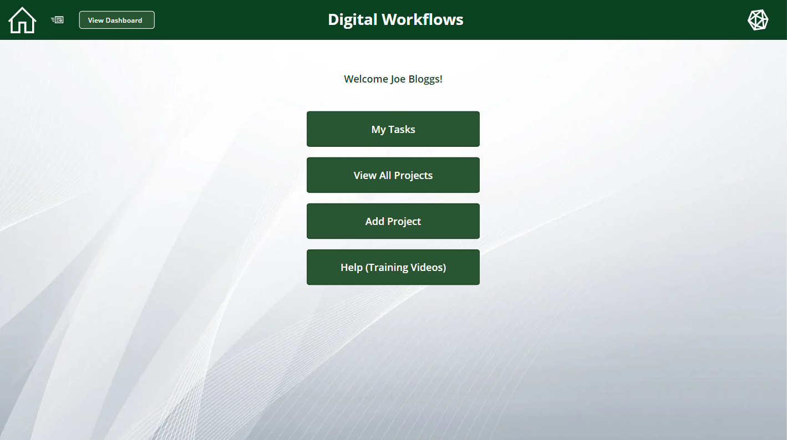
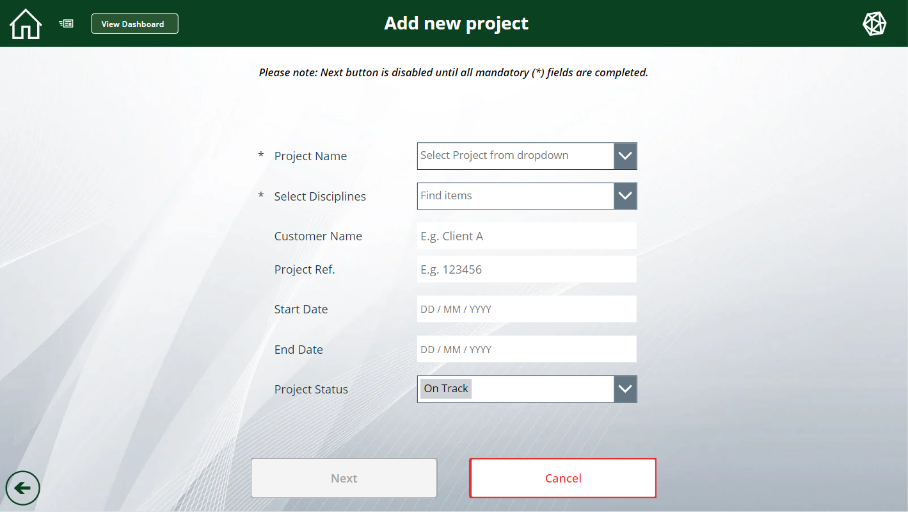
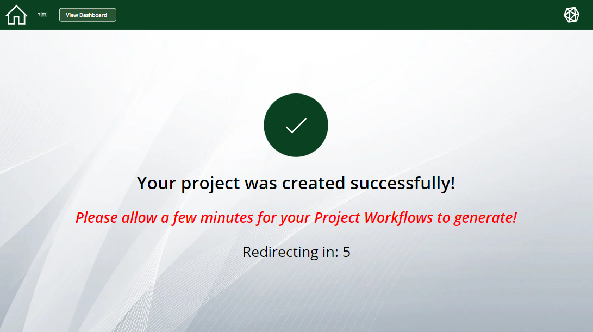
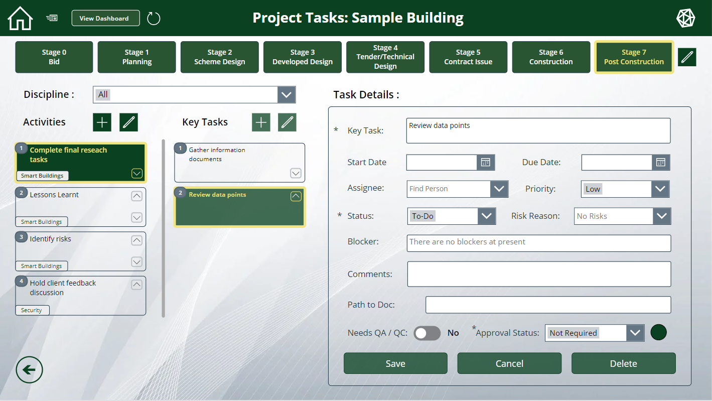
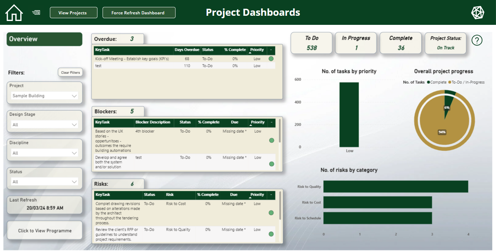
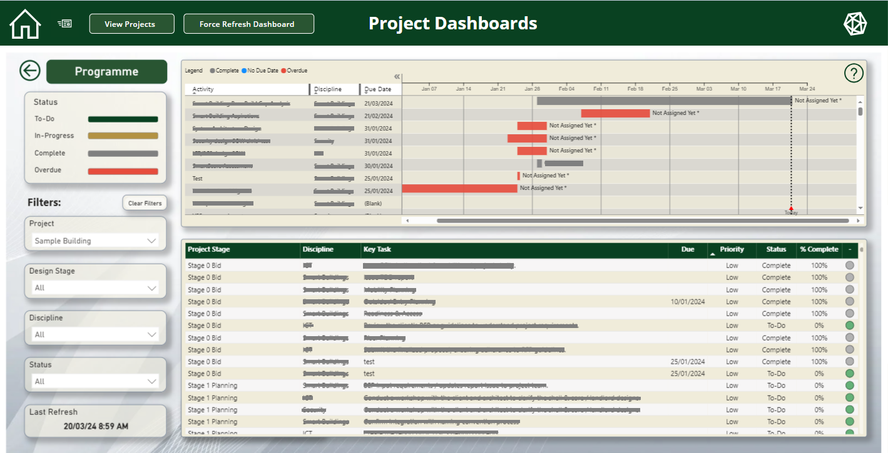

# Digital-Workflow-App

The Digital Workflow App also called "Elevate" was an app designed to streamline and simplify project management and workflow automation in the engineering industry.
In a nutshell, the app allows project managers to very easily set up a new engineering project on the system in just a couple of minutes.

Once this new project is set up, the app would automatically generate the entire list of generic tasks required for the project to be completed across different teams and disciplines in the company (mechanical, electrical, sustainability etc.)
The app allowed full flexibility for all PM's, directors, contractors and engineers working on each project to add, edit, and delete the task details because long term engineering and construction projects inevitably change over the course of months/years.

The app not only allowed users to keep full control over every task in the project but also provided security, permission levels, transparency across teams, easy access and valuable data insights from each project using provided dashboards in the app.

It was developed using Microsoft Power Platform including Power Apps, Power BI dashboards and SharePoint.
